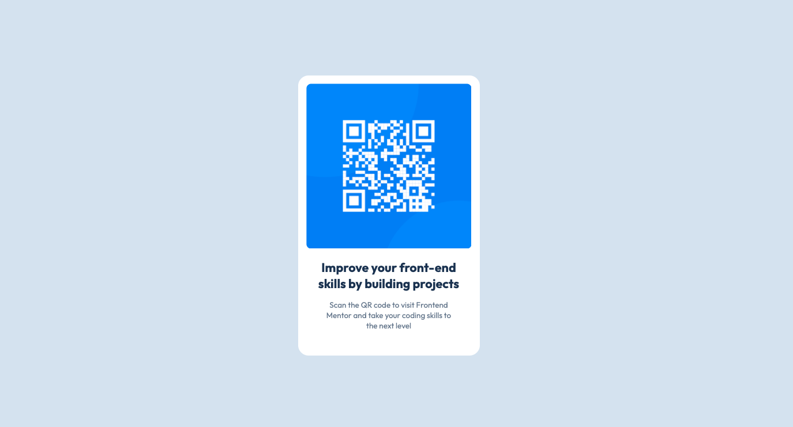
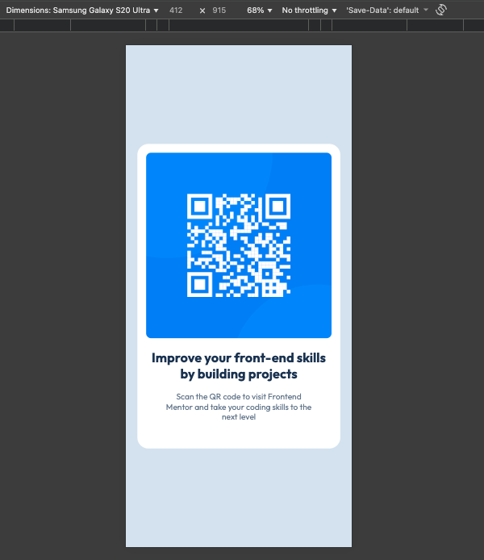

# Frontend Mentor - QR code component solution

This is a solution to the [QR code component challenge on Frontend Mentor](https://www.frontendmentor.io/challenges/qr-code-component-iux_sIO_H). Frontend Mentor challenges help you improve your coding skills by building realistic projects. 

## Table of contents

- [Overview](#overview)
  - [Screenshot](#screenshot)
  - [Links](#links)
- [My process](#my-process)
  - [Built with](#built-with)
  - [What I learned](#what-i-learned)
  - [AI Collaboration](#ai-collaboration)
- [Author](#author)
- [Acknowledgments](#acknowledgments)

## Overview

### Screenshot

### Links

- Solution URL: [Add solution URL here](https://your-solution-url.com)
- Live Site URL: [Add live site URL here](https://your-live-site-url.com)

## My process

### Built with

- HTML
- CSS(Flexbox)

### What I learned

I learned about Flexbox in CSS, which allows for flexible and efficient leayout designs:
* Display Flex: Set display: flex; om a container to enable Flexbox.
* Centering Content: Use justify-content: center; to center items horizontally.
* Vertical Alignment: Apply align-items: center; to align items vertically.
* Full Height: Set height: 100vh; on the body to ensure the layout occupies the full viewpoint height.

### AI Collaboration

I used Github Copilot to guide me through improvements, especially the flexbox and letting contents of a div to decide the actual width of the container instead of using fixed height.

## Author

- Website - [Alex Ngumbau](https://www.your-site.com)
- Frontend Mentor - [@alexngumbau](https://www.frontendmentor.io/profile/alexngumbau)
